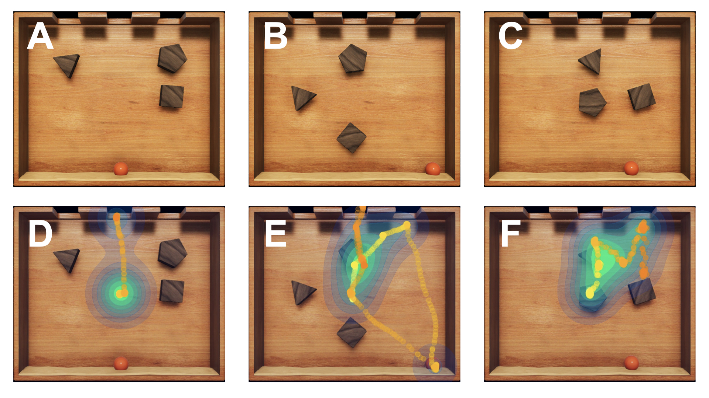
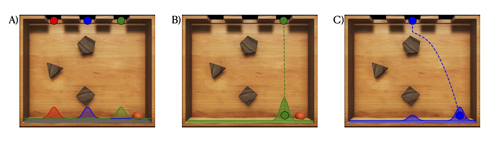
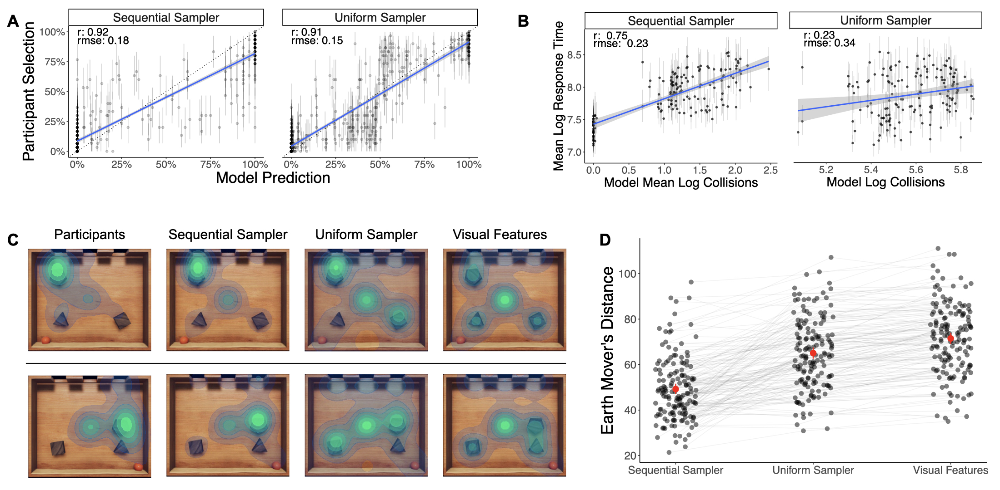

# Tracking Inference
This repo contains experiment, modeling, and analysis code for the paper "Looking into the past: Eye-tracking mental simulation in physical inference" by Aaron Beller, Yingchen Xu, Scott Lindermann and Tobias Gerstenberg.

## Paper Summary

The ability to infer latent causes from observed effects is a hallmark of human intelligence. If you find a vase broken on the ground and see your cat, Whiskers, resting in its place, you can infer without having to see the event that Whiskers likely knocked it over. These powerful inferences are made possible by rich intuitive theories encoding knowledge about how the world works (Gerstenberg & Tenenbaum 2017). These intuitive theories support mental simulations that allow us to predict how the world would evolve in imagined situation. In the domain of physical reasoning, prior research highlights the role of mental simulation as a powerful cognitive mechanism underlying human predictions in various tasks (e.g. Hegarty 2004; Battaglia, Hamrick, & Tenenbaum 2013; Dasgupta et al. 2018). In this space, eye-tracking has emerged as a promising form of behavioral data that provides unique insight into the mental simulations that people employ in physical reasoning tasks (Gerstenberg et al. 2017, Ahuja & Sheinberg 2019). In this work we bring together modeling tools for physical mental simulation with eye-tracking to study how people use mental simulation in a physical inference task, Plinko.

<div align="center"></div>

This figure illustrates the Plinko domain. After a brief training, participants are presented with inference trials like those shown in A-C. Participants see the final location of the ball and must infer which hole the ball fell from. On each trial, participants provide a categorical judgment indicating their best guess of the hole. In addition to this behavioral data, we also collect participant response times and eye-movement data. Panels D-F illustrate sample eye-movement traces from an individual participant. Yellow dots indicate the start of the trace, while orange dots indicate the end. The green glow reflects the overall density of eye-movement samples in a particular location.

<div align="center"></div>

We model participants mental simulations using a noisy physics engine (Battaglia, Hamrick, & Tenenbaum 2013). A noisy physics engine takes a standard physics engine and injects noise into the physical dynamics. The actual physical dynamics align reasonably well with human predictions, but the addition of noise allows the model to capture uncertainty that people show in their physical judgments. In our task we use the noisy physics engine to construct a conditional distribution on where the ball would land if it was dropped from a particular hole. Repeated simulation from a hole produces a set of samples that can be used to compute a kernel density estimate for the given hole. Treating these conditional probabilities as a likelihood, we can then compute the posterior probability assigned to each hole using Bayes' Rule (assuming a uniform prior on holes). With this posterior, our model can make a judgment.

But how does the model determine which holes to simulate from? Participant eye-movement data suggest that people favor certain hypotheses over others. To capture this pattern, we develop a sequential sampling model that balances simulations from holes that it thinks are correct with holes that is uncertain about. The figure above illustrates a sequence of model behavior. We initialize the kernel density for each hole with an initial bump under the hole location, reflecting a naive assumption that the ball will generally fall straight down. The model starts by simulating from the most probable hypothesis, the green hole. In so doing, the model discovers that if the ball had fallen from that hole it would have landed a little to the left of its actual location. The model now considers the green hole less probable than before, and it is more confident in the outcome, so it considers a new hypothesis, the blue hole. Simulating from this hole shows that this hypothesis is more likely correct. The model continues simulating until it is sufficiently confident in a single hole.

<div align="center"></div>

We evaluate our model's behavior against each of our three data signals. We compare our sequential sampler against a simpler uniform sampler that simulates equally from each of the three different holes. On the judgment data the models are similar in their performance. However in the response times the sequential sampler is able to capture a qualitative distinction between fast and slow trials that the uniform sampler cannot capture. The difference between the models is most striking in the eye-movment data. We predict the aggregated distribution of participant movement from two-dimensional kernel density estimates computed using a set of visual features as well as the locations of salient physical events in the model simulations like collisions and drops. Panel D shows that on average the Earth movers' distance between the participant distribution and the model distribution is lower for the sequential sampler then the uniform sampler. The uniform sampler is closer to a visual features baseline, that only uses visual features to predict the participant distribution. Panel C provides some indication of how the sequential sampler is improving above the uniform sampler and visual features model. On trials where the ball lands clearly on one side of the Plinko box, participants focus most of their visual attention to that area. The sequential sampler is able to capture this asymmetric allocation of attention, while the uniform sampler and visual features model struggle.

Overall, this project represents a first step toward understanding how people utilize mental simulation to perform physical inferences. Going forward we hope to investigate how people integrate sensory evidence from multiple modalities and how exactly eye-movement reflects underlying mental simulation.

### References

T. Gerstenberg, J. B. Tenenbaum (2017). Intuitive Theories. Oxford Handbook of Causal Reasoning.

Hegarty, M. (2004). Mechanical reasoning by mental simulation. Trends in cognitive sciences, 8(6), 280-285.

Battaglia, P. W., Hamrick, J. B., & Tenenbaum, J. B. (2013). Simulation as an engine of physical scene understanding. Proceedings of the National Academy of Sciences, 110(45), 18327-18332.

Dasgupta, I., Smith, K. A., Schulz, E., Tenenbaum, J. B., & Gershman, S. J. (2018). Learning to act by integrating mental simulations and physical experiments. BioRxiv, 321497.

Gerstenberg, T., Peterson, M. F., Goodman, N. D., Lagnado, D. A., & Tenenbaum, J. B. (2017). Eye-tracking causality. Psychological science, 28(12), 1731-1744.

Ahuja, A., & Sheinberg, D. L. (2019). Behavioral and oculomotor evidence for visual simulation of object movement. Journal of vision, 19(6), 13-13.

## Project Structure

```
.
├── code
│   ├── R
│   │   └── figures
│   ├── experiment
│   │   ├── exp_code
│   │   ├── images
│   │   └── videos
│   └── python
│       └── model
├── data
│   ├── human_data
│   └── stimuli
│       ├── ground_truth
│       └── practice
└── figures
    ├── cogsci_2022
    └── images
        ├── jpg
        └── png
```

## code

### python

#### model
This section contains model code. 

1. `model.py` contains the primary model code, including an agent class which represents the world, simulates, and infers the most likely drop location of the ball. Code for both the sequential sampler (bandit) and uniform sampler (fixed_sampler) are included in this module.

2. `engine.py` contains the physics engine code which supports the agent's physical inference procedure. 

3. `run_model.py` is a script that can be used to generate behavior for a model at a given set of parameters.

4. `convert_coordinate.py` is a module for transforming pymunk coordinates to unity coordinates.

5. `regression_analysis.py` contains procedures for fitting regressions from features of model behavior to distributions of human eye-movement.

6. `compute_regression_error.py` is a script to compute the squared error between distributions of human eye-movment and model eye-movement distributions predicted with features of model behavior.

7. `evaluate_heatmaps.py` contains procedures to measure the earth-movers distance between two heatmaps representing distributions of fixations.

8. `compute_emd.py` contains code to run the heatmap evaluation for a given model file.

9. `visual.py` contains visualization tools for the model behavior.

10. `config.py` contains code for generating new trial stimuli.

11. `utils.py` contains additional utilities and procedures for the model.

12. `model_performance` contains records of model performance, including judgments and response times, fixations locations, and computed earth-movers distance scores. Subfolders pre-pended with "grid" contain model behavior pre-computed on Stanford's high-performance computing cluster and are included for ease of replicating paper results.

13. `heatmaps` contains precomputed kernel density estimates for regression analysis. Histograms are pre-computed for all physical features of all trials (obstacles, holes, ball location, center), as well as human eye-gaze distributions computed for a train set (half participants) and test set (all participants).


### R

This section contains analysis and visualization code to produce model figures.

1. `analysis.Rmd` performs the grid search on the pre-computed model performance files. It then loads the top performing models and plots model results for the three different data signals.

2. `figures` folder containing base figures for results presentation in the paper.


### experiment

#### exp_code

1. `plinko_eyetracking.py` code to run the experiment. By default tracker is set to "dummy" mode, but can be connected to an actual eye-tracker by changing the ttype parameter at the top of the file.

2. `Output` folder where experiment output is saved as json file (empty).


#### images

Images for presenting stimuli, pratice trials, and training stills.

#### videos

Pratice videos


## data

### human_data

Contains compressed human data for the full experiment. The data is a pickled pandas dataframe compressed in xz format.

### stimuli

#### ground_truth

Contains json files representing the 150 trial stimuli. This files can be used by the physics engine to represent and simulate in the world according to the given conditions.

#### practice

Contains json files representing the 2 practice stimuli.


## figures

### cogsci_2022

Paper figures.

### images

Still images of the trial stimuli.


# Replicating paper results

## Using pre-computed model-performance

Model results and figures can be reproduced from pre-computed model performance using the analysis.Rmd file in `code/R/`. Navigate to the folder, open up the Rmd file in RStudio and knit the document to run all code chunks. The pre-knitted html file is included as well for those who don't have RStudio.

The analysis script includes code for our grid search, which loads data from half our participant set (n=15), loads model behavior for a large set of models, and evaluates the behavior of those models against our training data. Pre-computed model behavior is saved for use in the grid search in `code/R/python/model/model_performance/grid_judgment_rt` and `code/R/python/model/model_performance/grid_regression_error`.

The sequential sampler has four parameters: a decision threshold, reward-uncertainty tradeoff, kernel density bandwidth, and sample weight. We considered the following ranges for those parameters:

- decision threshold -- [0.75, 0.8, 0.85, 0.9, 0.95, 1.0, 1.05, 1.1]
- reward-uncertainty tradeoff -- [0.001, 0.003, 0.01, 0.03, 0.1]
- kernel-density bandwidth -- [10, 20, 30, 40]
- sample weight -- [450, 500, 550, 600, 650, 700, 750, 800, 850, 900, 950, 1000, 1050, 1100]

The parameter setting that minimized the error in our grid search was:

- decision threshold -- 0.95
- reward-uncertainty tradeoff -- 0.003
- kernel-density bandwidth -- 30
- sample weight -- 950

The uniform sampler has two parameters: the number of samples and the kernel-density bandwidth. We considered the following ranges for these parameter values:

- number of samples -- [10, 20, 30, 40, 50, 60, 70, 80, 90, 100]
- kernel-density bandwidth -- [5, 10, 15, 20, 25, 30, 35, 40, 45, 50]

The parameter setting that minimized the error in our grid search was:

- number of samples -- 40
- kernel-density bandwidth -- 50

After running the grid search the script loads performance from the top performing models and produces the visualizations and model results reported in the paper.

Libraries required to run the analysis script are the following:

- reticulate
- knitr
- Hmisc
- DescTools
- stringr
- egg
- tidyverse

## From scratch

### Generate model behavior

Model behavior for either the sequential sampler or the uniform sampler can be generated using the `run_model.py` script in `code/python/model/`.

To generate model behavior for the sequential sampler at a given parameter setting navigate to the folder `code/python/model` and run the following:

```
python run_model.py bandit <seed> <decision_threshold> <tradeoff> <bandwidth> <sample_weight>
```

The script will generate a csv recording judgments and number of collisions for 30 runs on each trial in the folder `model_performance/judgment_rt`. The model will also generate a pickle file recording all the physical events from all the simulations in the folder `model_performance/collisions`.

You can generate model behavior for the uniform sampler in an analogous way:

```
python run_model.py fixed_sample <seed> <num_samples> <bandwidth>
```

Python libraries required to run the model are the following:
- numpy
- pandas
- pymunk
- pygame
- scipy
- scikit-learn
- KDEpy

### Compute earth mover's distance

The `compute_emd.py` script takes a model and fits a regression from features of that model's behavior to the human distribution of eye-movement. It then computes the earth mover's distance between those predicted distributions and the actual human distributions. The script takes in a model events pickle file (model behavior generated in the collisions folder) and produces a csv giving the computed earth movers distance for each trial.

To compute the earth mover's distance for a given model you can run the following code:

```
python compute_emd.py <model_type> <model_file>
```

The model type specifies which kind of model you are computing the emd for. The three allowable arguments are `bandit` (sequential sampler), `fixed_sample` (uniform sampler), or `visual_features` (visual features baseline). The model file should be the filename for the pickle file containing the record of the model events (the relative path is not required). For the visual features regression, no model file is required.

The output of the emd computation is saved to the `model_performance/emd` folder. It will be named according to the corresponding model type.

Python libraries required to compute EMD are the following:
- numpy
- pandas
- scikit-learn
- KDEpy
- opencv
- scikit-image

# Running the experiment

Code for the experiment is in `code/experiment/exp_code`

To run the experiment type the following command:

```
python plinko_eyetracking.py
```

The experiment will begin by prompting you for demographic info in the command line and then switch over to a psychopy display for instructions and trials.

Data from the experiment is saved to the output folder as a json file. By default, the script is left in "dummy" mode meaning the mouse is used in place of input from an eye-tracker. This can be changed by changing the ttype argument at the top of the script. 

Python libraries required to run the experiment are the following:
- numpy
- psychopy
- pygaze

